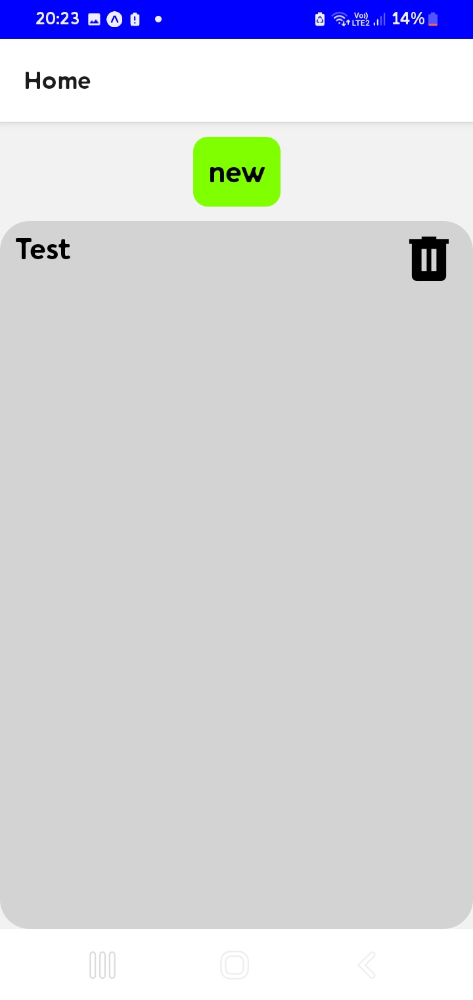
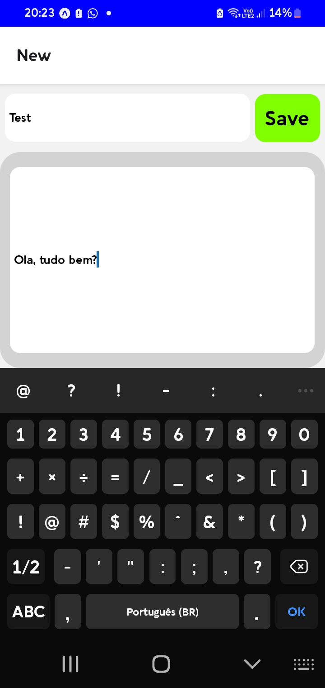
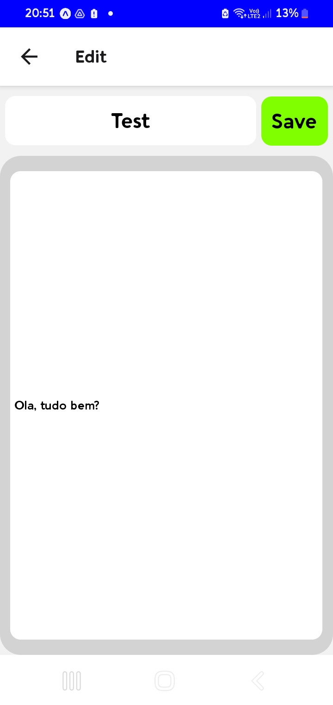

# 📱 NoteApp - Gerenciador de Textos

atividade da disciplina de desenvolvimento mobile, do curso de Tecnologias em sistemas para internet.

## 📌 Sobre

Aplicativo mobile de bloco de notas desenvolvido com:

- React Native + TypeScript
- Expo Router
- AsyncStorage

## ✨ Funcionalidades

| Tela | Descrição |
|------|-----------|
| **📜 Lista notas** | Visualiza todos os textos com botão de exclusão |
| **🆕 Nova nota** | Formulário para criar registros (título + conteúdo) |
| **✏️  Editar nota** | Modifica apenas o conteúdo dos textos existentes |

## 📱 Telas

### 📜 Lista notas

 

### 🆕 Nova nota

 

### ✏️  Editar nota

 

## 🚀 Como Executar

instale as dependencias

```bash
npm install
```
execute com

```bash
npm start
```

